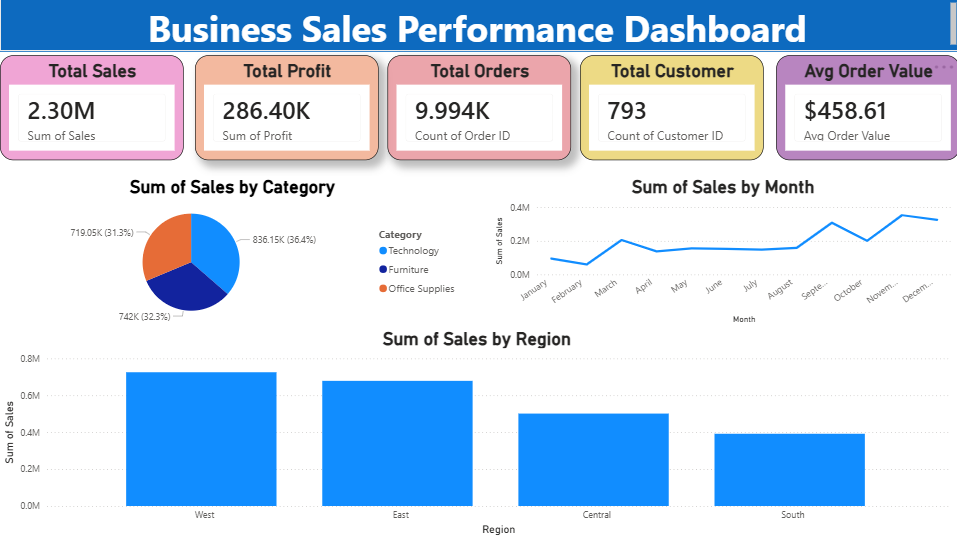

# FUTURE INTERNS – DATA SCIENCE & ANALYTICS TASK 1

## Business Sales Performance Analytics Dashboard

### 📌 Project Overview
This project analyzes business sales performance using Power BI, Python, and Excel to identify:
- Revenue trends
- Top-performing regions
- Sales by category
- Customer insights
- Average order value

---

## 🛠 Tools Used
- Power BI
- Python
- Excel
- Pandas
- Matplotlib

---

## 📂 Project Structure

dashboard/    -> Power BI Dashboard File  
dataset/      -> Dataset used for analysis  
images/       -> Generated charts and graphs  
python/       -> Python analysis scripts  
screenshots/  -> Dashboard screenshots  

---

## 📊 Dashboard Features
- Total Sales KPI
- Total Profit KPI
- Total Orders KPI
- Total Customers KPI
- Average Order Value KPI
- Sales by Category
- Monthly Sales Trend
- Regional Sales Analysis

---

## 📸 Dashboard Preview

---

## 📈 Key Insights
- West region generated the highest sales
- Technology category contributed major revenue
- Monthly sales showed upward growth trend
- Average Order Value was approximately $458

---

## 🚀 Outcome
Built an interactive and visually appealing business analytics dashboard for decision-making and performance tracking.
